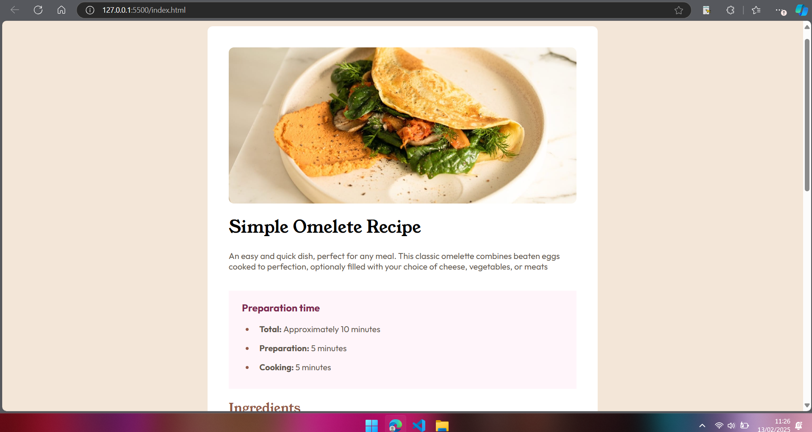

# Frontend Mentor - Recipe page solution

This is a solution to the [Recipe page challenge on Frontend Mentor](https://www.frontendmentor.io/challenges/recipe-page-KiTsR8QQKm). Frontend Mentor challenges help you improve your coding skills by building realistic projects.

## Table of contents

- [Overview](#overview)
  - [Screenshot](#screenshot)
  - [Links](#links)
- [My process](#my-process)
  - [Built with](#built-with)
  - [What I learned](#what-i-learned)
- [Author](#author)
- [Acknowledgments](#acknowledgments)

**Note: Delete this note and update the table of contents based on what sections you keep.**

## Overview

### Screenshot



### Links

- Solution URL: [Github](https://github.com/alinugroho/recipe-page)
- Live Site URL: [Vercel](https://recipe-page-ten-kohl.vercel.app/)

## My process

### Built with

- Semantic HTML5 markup
- CSS custom properties
- Flexbox
- CSS Grid
- Mobile-first workflow

### What I learned

```html
<table style="width: 100%">
  <tr>
    <td style="border: none"><p>Fat</p></td>
    <td style="border: none"><p class="data">22g</p></td>
  </tr>
</table>
```

```css
@media screen and (maxwidth: 576px) {
  .preparation-time {
    width: auto;
    margin-top: -30px;
    margin-inline: 5%;
  }
}
```

## Author

- Frontend Mentor - [@alinugroho](https://www.frontendmentor.io/profile/alinugroho)
- Instagram - [@aliinugroho](https://www.instagram.com/aliinugroho/)

## Acknowledgments

ALHAMDULILLAH
